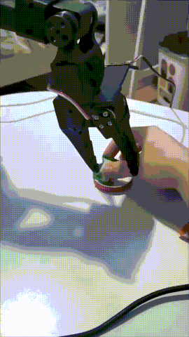

# 🤖 LeRobot × SO-101: Teleoperation → Imitation Learning → Real-Robot Deployment

<div align="center">

🌐 **English** · [**中文**](README.zh-CN.md)

</div>

> An **end-to-end, real-world robotics** project bridging Hugging Face [LeRobot](https://github.com/huggingface/lerobot), a low-cost **SO-101** follower arm (Feetech STS3215 × 6), and **self-developed leader-less teleoperation**, trained with **ACT**, and deployed **on the real robot** to pick a wrapped candy and place it into a lid.

[](https://www.python.org/)
[](LICENSE)
[](https://github.com/huggingface/lerobot)

---

## 🎬 Demo

<p align="center">
  <br/>
  <i>Autonomous ACT inference on the real end-effector: pick & place (GIF preview)</i>
</p>

<details open>
<summary>▶️ Play the full MP4 inline (HTML5 / GitHub)</summary>

<video src="media/demo.mp4" controls width="500" autoplay loop muted playsinline></video>

</details>

---

## ✨ What this project demonstrates

A complete robotics **data-driven control loop on a real manipulator**, with **no leader arm required**:

```
┌────────────┐   keyboard / gamepad    ┌──────────────────┐
│  Operator  │ ──────────────────────▶ │ Teleoperation     │
└────────────┘                          │ (leader-less)     │
                                        └──────────────────┘
                                                  │ actions
                                                  ▼
┌────────────┐   states/images          ┌──────────────────┐
│  SO-101    │ ◀────────────────────── │ LeRobot pipeline  │
│ follower   │ ──────────────────────▶ │ (record/train/eval)│
└────────────┘   obs.images.front,      └──────────────────┘
                 obs.state (6 joints)
```

| Stage | Implementation |
|------|----------------|
| 🖱️ Teleoperation | **Gamepad analog velocity control** (`gamepad_joints`) and **Keyboard incremental step control** (`keyboard_joints`), both leader-less |
| 🗃️ Dataset | ~50+ real pick-and-place episodes (`wrap candy → lid`), plus a **data-cleaning / episode-filtering workflow** and frame-accurate video indexing |
| 🧠 Policy | **ACT** (Action Chunking with Transformers, ResNet18 backbone) trained locally |
| 🎯 Deployment | Real-robot evaluation via LeRobot **rollout**, with recorded demos |

**Why it is interesting even with limited hardware:** the full stack runs on a **single laptop with an RTX 3060 (6 GB VRAM)** — from raw teleoperation data to a policy that physically moves the arm.

---

## 🧱 What is new (self-developed, on top of LeRobot)

This repository is **not a fork full of copied code** — it is a clean **engineering showcase** containing only the **self-authored / hand-tuned pieces** applied on top of a pinned upstream. Highlights:

1. **Leader-less teleoperation for a follower-only arm**
   - `gamepad_joints` — **analog velocity mapping**: 4 sticks → 4 joints at configurable speed & direction, deadzone & soft clipping; trigger/bumper buttons drive `wrist_flex` and `gripper`.
   - `keyboard_joints` — accessible step control for no-gamepad / quick checks; handles terminal- vs pynput-based key capture.
   - Both register as first-class LeRobot **teleoperator subclasses**, so they plug into the existing record/teleoperate ecosystem without forking training.

2. **Data engineering for reliable imitation datasets**
   - Episode-level **quality filtering** (`delete_episodes` on a curated clean set).
   - **Timestamp integrity fix** for frame-accurate video indexing after interrupted recordings.
   - `dataset_episode_viewer.py`: export per-episode **MP4 preview with live joint curves** (pyAV-based, works even when the default `torchcodec` decode backend is broken in some environments).
   - `gamepad_probe.py`: quickly inspect raw axis/button IDs for any USB gamepad.

3. **Local end-to-end training + real-robot eval**
   - Scripted commands for record → train → rollout with the exact flags that worked on a 6 GB GPU, including the **pyAV decode/encode** workaround.

> 📦 Upstream: [Hugging Face LeRobot](https://github.com/huggingface/lerobot) — this repo intentionally does **not** vendor the entire upstream source; refer to the pinned commit in [`docs/PIPELINE.md`](docs/PIPELINE.md).

---

## 🚀 Quickstart (from scratch)

### 1. Hardware & environment

- **SO-101** follower: Feetech STS3215 servo bus (or SO-100), calibrated joints
- USB webcam exposed as `/dev/video2` (640×480 @ 30)
- USB **gamepad** (analog sticks & buttons — verified with both Logitech-style and generic HID pads)

```bash
conda activate lerobot   # Python 3.12, PyTorch + CUDA, feetech SDK, rerun/av
# Note: use pyAV backend to avoid torchcodec-install pitfalls
```

### 2. Record a real pick-and-place dataset (gamepad)

```bash
bash scripts/record_pick_place.sh
```

Keyboard recording control while gamepad drives the arm:
- `→` / `n` end current episode · `←` / `r` re-record · `Esc` / `q` stop

### 3. (Optionally) inspect & prune episodes

```bash
python examples/dataset_episode_viewer.py \
  --repo-id zane/pick_place_block_clean \
  --root ./datasets/pick_place_block_clean --episode 0
```

### 4. Train ACT (single RTX 3060 6 GB)

```bash
bash scripts/train_act.sh
```

### 5. Real-robot evaluation

```bash
bash scripts/rollout_eval.sh
```

---

## 🗂 Repository layout

```text
.
├── README.md
├── media/demo.mp4              # real-robot infer video
├── docs/
│   ├── ARCHITECTURE.md          # system design & teleop mapping details
│   ├── PIPELINE.md               # pinned upstream + step-by-step reproduction
│   └── TROUBLESHOOTING.md        # real issues we met & how we fixed them
├── lerobot_mods/
│   ├── gamepad/                 # gamepad_joints teleoperator (config + class)
│   └── keyboard/                # keyboard_joints teleoperator (config + class)
├── examples/
│   ├── dataset_episode_viewer.py  # MP4 with joint-curve overlay (pyAV)
│   └── gamepad_probe.py           # inspect axis/button IDs
└── scripts/
    ├── record_pick_place.sh
    ├── train_act.sh
    └── rollout_eval.sh
```

---

## 📐 Main design decisions

- **Keep policy = ACT, inputs = 6-DOF state + one front camera.** It is the sweet spot for low-VRAM and gives quick real-robot iteration.
- **Leader-less does not mean cartesian.** The joints are velocity-commanded from the sticks; this is simpler and far more robust than a rough IK on a 5-DOF wrist.
- **Data quality > data quantity.** Clean ~48 episodes beat a noisy 55. We added explicit episode pruning + validation tooling to enforce it.
- **Video decode pinning to pyAV.** Removes an entire class of environment-level `torchcodec`/FFmpeg breakage and makes every tool run consistently on the same data.

---

## 📚 Where to go next (Roadmap)

- [ ] Formal success-rate statistics over N=10+ real runs
- [ ] Introduce diversity acquisition (candy orientation / position / lighting) to close the sim-vs-real generalization gap observed during early tests
- [ ] Push dataset & checkpoint to Hugging Face Hub for reproducibility

---

## 🙏 Acknowledgements

- [Hugging Face LeRobot](https://github.com/huggingface/lerobot) — framework
- [SO-101 arm project community](https://github.com/TheRobotStudio/SO-ARM100) — hardware
- ACT: *Embodied AI via Action Chunking with Transformers* (Zhao et al., 2023)

## License

The original LeRobot code is Apache-2.0. This project's original code and docs are released under the [Apache-2.0 license](LICENSE).
